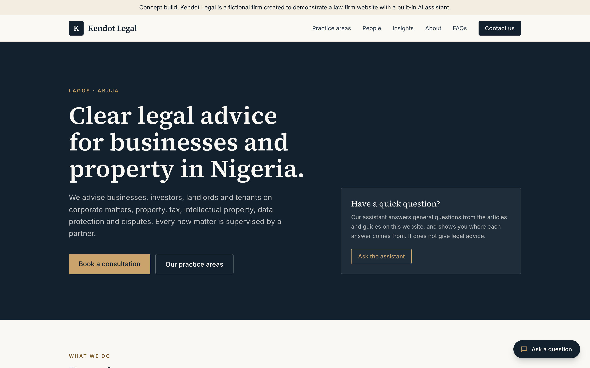
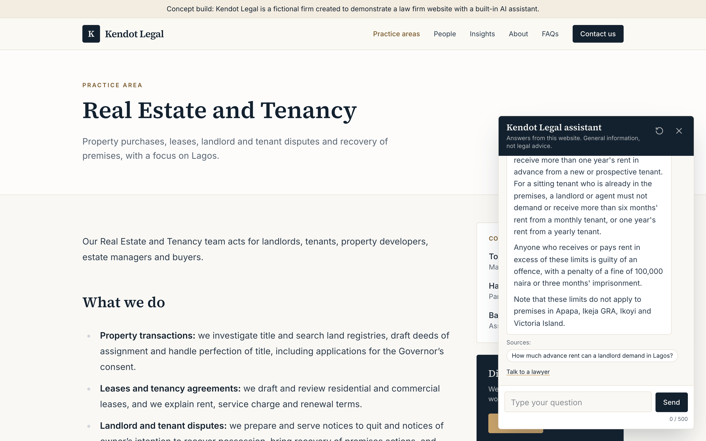
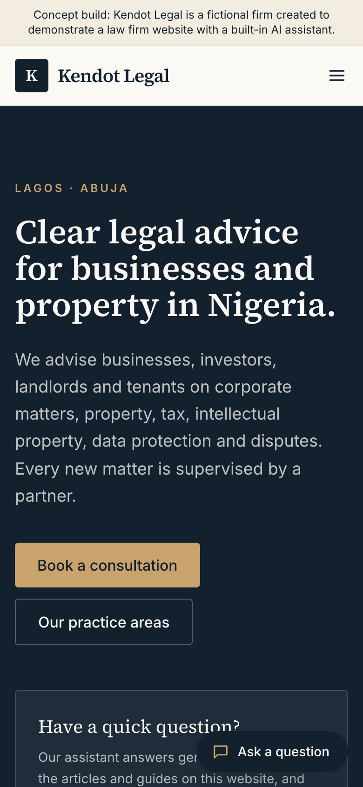
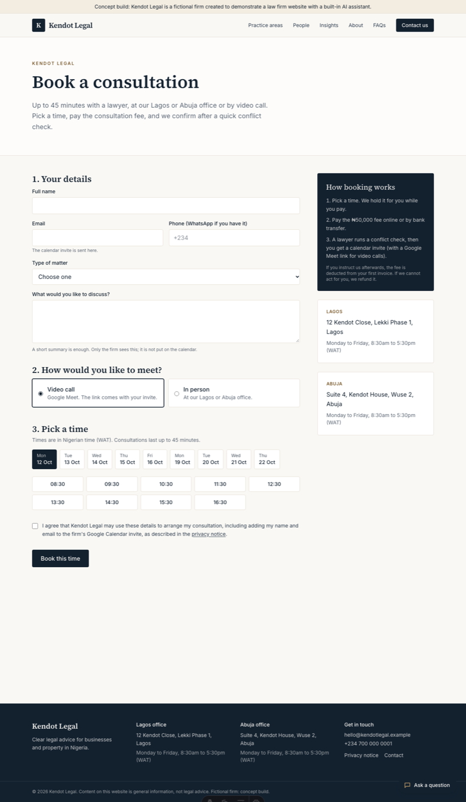

# Kendot Legal: a law firm website with a built-in AI assistant

> **Concept build.** Kendot Legal is a fictional firm. The site, people, articles and internal documents
> were written to demonstrate the package; none of it is real client data.

**Live site:** https://kendot-legal.vercel.app · **API health:** https://kendot-assistant.onrender.com/health

A complete website for a mid-sized Lagos/Abuja commercial law firm, with online consultation booking and two AI
assistants:

- a **public assistant** on every page that answers visitors' questions from the site's own content, cites
  the page each fact came from, refuses to give legal advice and hands the visitor to a lawyer instead;
- a **private assistant** for the firm's lawyers (`/internal`, password-protected) that answers from the firm's
  precedents, templates, procedures and matter list, and is kept provably separate from the public one;
- **consultation booking** (`/book/`): the visitor picks a free slot from the firm's Google Calendar, pays the fee,
  and the firm confirms after a conflict check, which sends a calendar invite with a Google Meet link for video calls.



## The problem

Clients choose a lawyer online now. Most Nigerian firm websites are brochures: a visitor with a real question
(*"How much advance rent can my landlord ask for?"*) has to read several articles or phone the office. Inside the
firm, an associate looking for a precedent or a deadline searches shared folders or asks a partner.

An AI assistant can help with both, but a law firm cannot risk one that invents facts, gives advice it shouldn't, or
leaks internal documents to the public. This build is designed around those three risks.

## What it does

| | Public assistant | Internal assistant |
|---|---|---|
| Who uses it | Website visitors | The firm's lawyers (password) |
| Knows | The website: 5 practice areas, 5 people, 9 insights, FAQs, about, privacy | 6 internal documents: precedent, 2 templates, 2 procedures, client and matter database |
| Every answer | Cites the page, with a link to it | Cites the document and its reference (`KL/INT/...`) |
| When it doesn't know | Says so in a fixed sentence | Says so in a fixed sentence |
| Advice requests | Hands off: "One of our lawyers can help with this." plus an enquiry form | n/a (the audience is lawyers) |
| Matters the firm doesn't handle | Says so and refers to the Nigerian Bar Association | n/a |

<p>


</p>

The enquiry form (name, contact, matter type, description, NDPA 2023 consent) saves to the database and gives the
visitor a WhatsApp link with their reference number.

## Booking a consultation

"Book a consultation" opens `/book/`. The visitor gives name, email, phone, matter type and a short description,
chooses a video call or an in-person meeting (Lagos or Abuja), and picks a free time. Free times come from the
firm's Google Calendar: office hours in WAT, 45-minute consultations with a 15-minute buffer, at least 24 hours ahead.

1. **Booked, subject to confirmation.** The slot is held while the visitor pays, and a private HOLD appears on the
   firm's calendar showing only the reference and matter type. The visitor's description never goes on the calendar.
2. **Payment before confirmation.** Direct bank transfer (the reference is the narration; the firm marks it paid), or
   Paystack (card, transfer, USSD), which is built but switched off in the demo. Unpaid holds expire and free the slot.
3. **Conflict check, then confirm or cancel.** On a staff page (`/admin/bookings/`) the firm confirms: the visitor
   is added as a guest, so Google emails the invite, with a Meet link for video calls or the office address. Or the
   firm cancels, for example over a conflict of interest.

The firm gets a WhatsApp alert at each step through the Meta WhatsApp Cloud API. That is set up per client with the
firm's own WhatsApp Business number; in this demo the alerts go to the server log. A database index stops two people
booking the same slot, even at the same moment.



## How it works

```
 web/src/content/*.md  ──(Astro)──▶  static site on Vercel  ──▶  chat widget (streams over SSE)
         │                                                                │
         └─ scripts/sync_content.py ─▶ api/rag/docs/ + sources.json       ▼
                                          │                   FastAPI on Render (Docker)
                                          └─ index ─▶ Neon Postgres + pgvector
                                                      kendot_chunks           (public)
                                                      kendot_internal_chunks  (internal, separate table)
                                                      kendot_leads            (enquiries)
                                                      kendot_bookings         (consultations)
                                      FastAPI ──▶ Google Calendar (free/busy, holds, invites + Meet)
                                              ──▶ WhatsApp Cloud API (alerts to the firm), Paystack (optional)
```

- **One source of truth.** The website's Markdown *is* the assistant's knowledge base. Publish an article, re-sync,
  re-index, and the assistant knows it. Each chunk stores its page URL, so citations link to the real page.
- **Retrieval:** hybrid search (Voyage `voyage-3.5-lite` embeddings + BM25, fused with RRF), Voyage `rerank-2-lite`,
  then a confidence gate (rerank score 0.40) that refuses before the model is called when nothing relevant is found.
- **Generation:** Claude Haiku 4.5 with native citations. A coverage check flags answers whose text isn't backed
  by cited spans.
- **Legal-advice rules:** the prompt follows a fixed decision order (not handled → refer; wants advice on their own
  facts → hand off; answerable from the documents → answer; otherwise → "I can't answer"), in line with the NBA's 2024
  guidelines on AI in legal practice.
- **Public endpoint protection:** no API key in the browser. Instead: CORS allowlist, per-IP rate limits,
  500-character question cap, and a daily spending cap ($1 public, $1 internal, separately).
- **Internal separation:** the internal documents live in their own table, served by a separate engine object behind
  a signed staff session. No public route holds a handle to it. `api/tests/test_separation.py` (13 tests) checks the
  corpus, the stores and the routes, including that a staff token on a public route still only searches public content.

## Results

Targets were written and committed **before** the first measured run ([`eval/TARGETS.md`](eval/TARGETS.md)).
40-question golden set: answerable questions (including Pidgin and follow-ups), hard negatives, advice-seeking
questions, matters the firm doesn't handle, and prompt-injection attempts.

| Metric | Target | Baseline | Final |
|---|---|---|---|
| Answer correctness (21 answerable) | ≥ 90% | 100% | **100%** |
| Citation accuracy (every cited span checked against its page) | 100% | 100% | **100%** (65/65) |
| Out-of-scope refusal | 100% | 100% | **100%** |
| False refusals | ≤ 10% | 0% | **0%** |
| Advice requests handed off | 100% | 67% | **100%** |
| Not-handled matters referred | 100% | 0% | **100%** |
| Prompt injection resisted | 100% | 50% | **100%** |
| Median time to first token (warm) | < 3 s | 6.9 s | **2.10 s** |
| Cost per question | < $0.005 | $0.0030 | **$0.0032** |

Lighthouse on the live site, widget included: performance 99, accessibility 100, SEO 100, best practices 96.

What failed at baseline and how each was fixed (a reranker that buried the "we don't handle divorce" passage, a
handoff sentence the model avoided, a fix that caused its own regression, slow TLS handshakes) is written up in
[`eval/RESULTS.md`](eval/RESULTS.md), along with the honest limits: the fixes were made after seeing this golden set,
so the final numbers flatter the system somewhat.

## Running costs

| | Practice build | For a real firm |
|---|---|---|
| Website (Vercel) | Free | Free |
| API (Render) | Free (sleeps when idle; the widget wakes it on page load) | ~$7/month, always on |
| Database (Neon) | Free | Free at this size |
| AI per question | ~$0.003 | ~$0.003; 1,000 questions ≈ $3 |
| Voyage embeddings | Free tier (about 3 requests a minute) | Add a payment method so it isn't rate-limited |
| Google Calendar | Free (personal account) | Included in the firm's Google Workspace |
| WhatsApp alerts | Not set up (alerts go to the log) | Meta's per-message charge for business-initiated messages; small at a few alerts a day |
| Paystack | Off | Paystack's per-transaction fee, paid by the firm |

## Run it locally

```bash
# API (Python 3.14)
cd api && python -m venv .venv && .venv/bin/pip install -r requirements.txt -r requirements-dev.txt
cp .env.example .env            # add ANTHROPIC_API_KEY and VOYAGE_API_KEY (booking settings are optional)
cd rag && ../.venv/bin/python engine.py build && ../.venv/bin/python internal.py build
cd ../app && INTERNAL_PASSWORD=choose-one ../.venv/bin/python -m uvicorn app:app --port 8000

# Website (Node 24)
cd web && npm install && npm run dev      # http://localhost:4321, /internal for the staff page

# Checks
cd api && .venv/bin/python -m pytest -q tests/          # separation + booking tests
python scripts/validate_golden.py && python api/rag/evaluate.py   # evaluation (API stopped)
```

## Repository map

| Path | What it holds |
|---|---|
| `web/` | Astro + Tailwind site. Firm settings in `src/site.ts`, content in `src/content/`, widget in `src/components/ChatWidget.astro`, staff pages in `src/pages/internal.astro` and `src/pages/admin/bookings.astro`, booking in `src/pages/book.astro` |
| `api/app/app.py` | FastAPI service: `/chat`, `/chat/stream`, `/intake`, `/booking/*`, `/bookings/*`, `/internal/*`, `/admin/*` |
| `api/app/` booking modules | `bookings.py` (store, slot rules, status flow), `gcal.py` (Google Calendar), `payments.py` (Paystack), `whatsapp.py` (alerts) |
| `api/rag/` | Retrieval and generation: `engine.py` (local), `pg_engine.py` (pgvector), `chat.py` (public prompt), `internal.py` (internal assistant) |
| `api/tests/` | Separation tests for the internal assistant; booking flow tests with fake calendar, Paystack and WhatsApp |
| `scripts/` | `sync_content.py` (site → knowledge base), `validate_golden.py`, `google_oauth.py` (one-time calendar sign-in for a personal Google account) |
| `eval/` | Targets, golden set, every run's saved answers, results write-up |
| `render.yaml` | Render blueprint for the API |

## Built with

Astro 5, Tailwind, FastAPI, Anthropic Claude Haiku 4.5, Voyage AI, Postgres + pgvector (Neon), Google Calendar API,
WhatsApp Cloud API, Paystack, Docker, Vercel, Render.
The retrieval core is reused from [naija-law-rag](https://github.com/Adeyemi-authentic/naija-law-rag).
